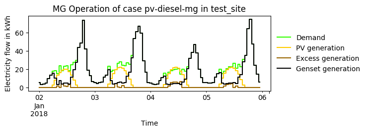

==========================================
Exemplary electricity supply systems
==========================================

Currently, following operational modes will be analyzed, mostly with capacities resulting from the `base case <https://github.com/smartie2076/simulator_grid-connected_micro_grid/wiki/Base-case:-Off-grid-micro-grid>`_:

* Off-grid micro grid with fixed capacities
* Off-grid micro grid interconnecting to national grid (consumption)
* Off-grid micro grid interconnecting to national grid (consumption and feed-in)
* Optimal local capacities for off-grid site with national grid access

The results of the oemof-optimizations have to be interpreted considering the evaluated scenario:

#. **Dispatch optimization of off-grid micro grid** with base case capacities.
#.  **Off-grid micro grid** with base case capacities interconnecting with national grid:
    * Only consumption from national grid
    * Consumption from and feed-in to national grid

Further detail on that can be found in `Evaluation of oemof results <https://offgridders.readthedocs.io/en/latest/Evaluation.html>`_.

Off-grid micro grid with fixed capacities
-----------------------------------------
Off-grid micro grid interconnecting to national grid
-----------------------------------------------------
This case analyses the dispatch the capacities in an implemented off-grid micro grid sized within the base case scenario. It takes into account blackout events. To eliminate the influence of blackouts on this case set both _blackout_duration_ and _blackout_frequency_ in the input list to 0. Two cases can be analyzed:

1. **Only electricity consumption**:
An interconnection with the main grid only allows consumption from the national grid through the point of common coupling, as long as the grid is not subject to blackouts.

2. **Electricity consumption and feed-in**:
An interconnection with the main grid allows consumption from as well as feed-into the national grid through the point of common coupling, as long as the grid is not subject to blackouts.

Optimal local capacities for off-grid site with national grid access
---------------------------------------------------------------------
An optimization of backup-capacities of an off-grid site already connected to a blackout-ridden national grid is performed. (Following pictures present the results?)

.. figure:: ../pictures/diesel_mg_4days.png
    :width: 5000px
    :align: center
    :height: 280px
    :alt: alternate text
    :figclass: align-center

    Diesel generator supply

    PV-Diesel micro grid, no storage

.. figure:: ../pictures/pv-diesel-storage-mg_4days.png
    :width: 5000px
    :align: center
    :height: 380px
    :alt: alternate text
    :figclass: align-center

    Hybrid micro grid (PV, storage)

.. figure:: ../pictures/pv-wind-storage-diesel-mg_4days.png
    :width: 5000px
    :align: center
    :height: 390px
    :alt: alternate text
    :figclass: align-center

    Hybrid micro grid (PV, wind, storage)

.. figure:: ../pictures/ongrid_mg_cons_4days.png
    :width: 5000px
    :align: center
    :height: 300px
    :alt: alternate text
    :figclass: align-center

    Hybrid micro grid (PV, storage), connected to central grid with intermittent blackouts